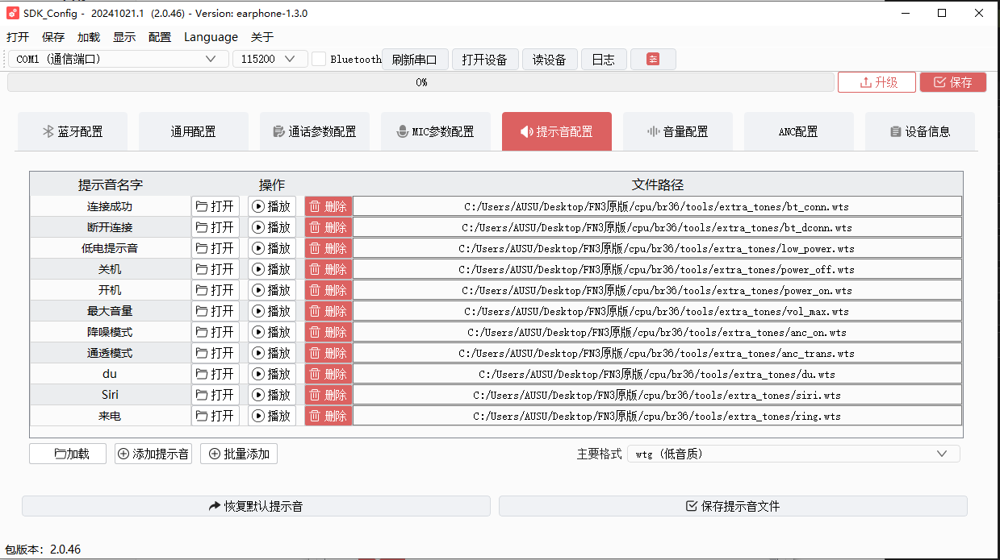

基于V138公版软件的鼎合丰内部版本V1

# 替换提示音

为了方便知道耳机的状态，把所有的音效改成中文。

## 替换

打开配置工具入口，点击配置工具：



1. 收集对应的中文MP3格式的音效素材
2. 把原有音效删除，新音效改为同名MP3
3. 然后点击打开选中即可
4. 格式跟原来一样，点击保存提示音文件
5. 再点击保存到bin即可编译生效。

# 打印

打开打印总开关：`apps\earphone\include\app_config.h`

```c
/*
 * 系统打印总开关
 */

#define LIB_DEBUG    0  //打开打印
#define CONFIG_DEBUG_LIB(x)         (x & LIB_DEBUG)

 #define CONFIG_DEBUG_ENABLE

#ifndef CONFIG_DEBUG_ENABLE
#define CONFIG_DEBUG_LITE_ENABLE  //轻量级打印开关, 默认关闭
#endif
```

## 使用

```c
printf("=== Log Test Start ===\n");
    
    // 测试普通打印
    printf("Normal printf working\n");
    
    // 测试日志级别打印
    log_info("Info log test\n");
    log_debug("Debug log test\n");
    log_error("Error log test\n");
    
    printf("=== Log Test End ===\n");
```

**普通printf输出**：

```c
[00:00:00.321]=== Log Test Start ===
[00:00:00.322]Normal printf working
```

- 格式：`[时间戳]内容`
- 特点：简单直接，只显示时间和内容

**log_info输出**：

```c
[00:00:00.322][Info]: [APP]Info log test
```

- 格式：`[时间戳][Info]: [APP]内容`
- 特点：包含了日志级别(Info)和模块标签(APP)

**log_error输出**：

```c
[00:00:00.323](error): <Error>: [APP]Error log test
```

- 格式：`[时间戳](error): <Error>: [APP]内容`
- 特点：错误日志有特殊标记，更容易识别

**时间戳格式**：

- 格式：`[HH:MM:SS.mmm]`
- 例如：`[00:00:00.321]`
- 精确到毫秒级别

## 日志输出

对于日志输出，需要以下配置：

**必需的宏定义**（这些要在包含头文件之前定义）：

```c
// 定义模块名称
#define LOG_TAG_CONST       APP    // 模块名称（大写）
#define LOG_TAG             "[APP]" // 模块标签（方括号格式）

// 启用需要的日志级别
#define LOG_ERROR_ENABLE    // 启用错误日志
#define LOG_DEBUG_ENABLE    // 启用调试日志
#define LOG_INFO_ENABLE     // 启用信息日志
//#define LOG_DUMP_ENABLE   // 启用数据打印（可选）
#define LOG_CLI_ENABLE      // 启用命令行（可选）
```

**必需的头文件**：

```c
#include "debug.h"          // 包含调试相关定义
```

**完整示例**：

```c
#include "app_config.h"     // 首先包含应用配置

// 日志配置（必须在debug.h之前）
#define LOG_TAG_CONST       APP
#define LOG_TAG             "[APP]"
#define LOG_ERROR_ENABLE
#define LOG_DEBUG_ENABLE
#define LOG_INFO_ENABLE
#define LOG_CLI_ENABLE

// 包含日志头文件
#include "debug.h"

// 使用示例
void test_function(void)
{
    log_info("Info message\n");
    log_debug("Debug message\n");
    log_error("Error message\n");
}
```

记住：

- 宏定义必须在包含 debug.h 之前

- app_config.h 中确保 LIB_DEBUG = 0

- 只有定义了对应的 ENABLE 宏，对应级别的日志才会输出

这样配置后就可以使用各种日志函数了：

- log_info() - 信息日志

- log_debug() - 调试日志

- log_error() - 错误日志

## 彩色打印还不会使用

# `app_main()`这个入口函数

系统初始化阶段：

```c
void app_main()
{
    int update = 0;
    u32 addr = 0, size = 0;
    struct intent it;
    
    printf("进入SDK入口\n");
    log_info("app_main\n");
    // 记录启动时间
    app_var.start_time = timer_get_ms();
```

音频编解码初始化:

```c
#if (defined(CONFIG_MEDIA_NEW_ENABLE) || (defined(CONFIG_MEDIA_DEVELOP_ENABLE)))
    /*解码器*/
    audio_enc_init();  // 编码器初始化
    audio_dec_init();  // 解码器初始化
#endif
```

升级检查：

```c
    if (!UPDATE_SUPPORT_DEV_IS_NULL()) {
        update = update_result_deal();  // 处理升级结果
    }
    
    app_var_init();  // 初始化应用变量
```

启动模式判断和应用选择：

```c
    if (get_charge_online_flag()) {  // 如果是充电启动
        // 电压检测初始化
        #if(TCFG_SYS_LVD_EN == 1)
            vbat_check_init();
        #endif

        // 启动空闲应用
        init_intent(&it);
        it.name = "idle";
        it.action = ACTION_IDLE_MAIN;
        start_app(&it);
    } else {  // 正常开机启动
        // 检查电源电压
        check_power_on_voltage();
        // 开机检查
        app_poweron_check(update);
        // UI管理初始化
        ui_manage_init();
        ui_update_status(STATUS_POWERON);
```

根据配置启动不同应用：

```c
#if  TCFG_ENTER_PC_MODE  // PC模式
        init_intent(&it);
        it.name = "pc";
        it.action = ACTION_PC_MAIN;
        start_app(&it);
#elif TCFG_ENTER_HEARING_AID_MODE  // 助听器模式
        init_intent(&it);
        it.name = "hearing_aid";
        it.action = ACTION_HEARING_AID_MAIN;
        start_app(&it);
#elif TCFG_ADC_IIS_ENABLE  // LineIn模式
        init_intent(&it);
        it.name = "linein";
        it.action = ACTION_LINEIN_MAIN;
        start_app(&it);
        app_curr_task = APP_LINEIN_TASK;
#else  // 默认耳机模式
        init_intent(&it);
        it.name = "earphone";
        it.action = ACTION_EARPHONE_MAIN;
        start_app(&it);
#endif
```

主要任务列表定义在开头：

```c
const struct task_info task_info_table[] = {
    {"app_core",            1,     768,   256  },  // 核心任务
    {"sys_event",           7,     256,   0    },  // 系统事件
    {"systimer",            7,     128,   0    },  // 系统定时器
    {"btctrler",            4,     512,   384  },  // 蓝牙控制
    {"btencry",             1,     512,   128  },  // 蓝牙加密
    {"btstack",             3,     768,   256  },  // 蓝牙协议栈
    {"audio_dec",           5,     800,   128  },  // 音频解码
    {"audio_enc",           6,     768,   128  },  // 音频编码
    // ... 其他任务
};
```

整体启动流程：

1. 系统初始化
2. 音频编解码初始化
3. 检查是否需要升级
4. 初始化应用变量
5. 判断启动模式(充电/正常开机)
6. 根据配置启动对应应用(PC/助听器/LineIn/耳机)

其他重要函数：

- `app_poweron_check()`: 开机检查
- `check_power_on_key()`: 检查开机按键
- `app_var_init()`: 初始化应用变量
- `timer_2ms_handler()`: 2ms定时器中断处理

这是一个典型的嵌入式系统启动流程，通过配置可以灵活切换不同的应用模式。

## 在关键流程处添加打印分析流程

- 在 app_main.c文件中：添加了启动时的日志打印

  - 添加了编解码器初始化的日志打印

  - 添加了升级检查的日志打印

  - 添加了应用变量初始化的日志打印

  - 添加了开机检查流程的日志打印

  - 添加了应用启动的日志打印

- 在 update.c文件中：添加了升级结果处理的日志打印

  - 添加了升级模式API的日志打印

  - 添加了升级前跳转处理的日志打印

  - 在 dev_update.c文件中：添加了设备升级检查的日志打印

  - 添加了升级状态回调的日志打印

  - 添加了升级前跳转处理的日志打印
